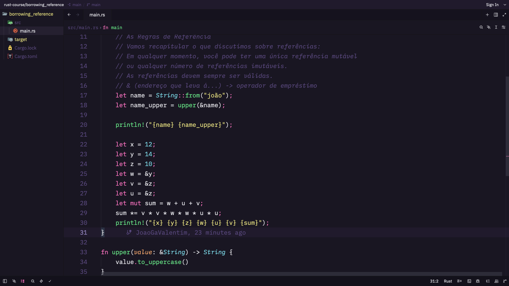
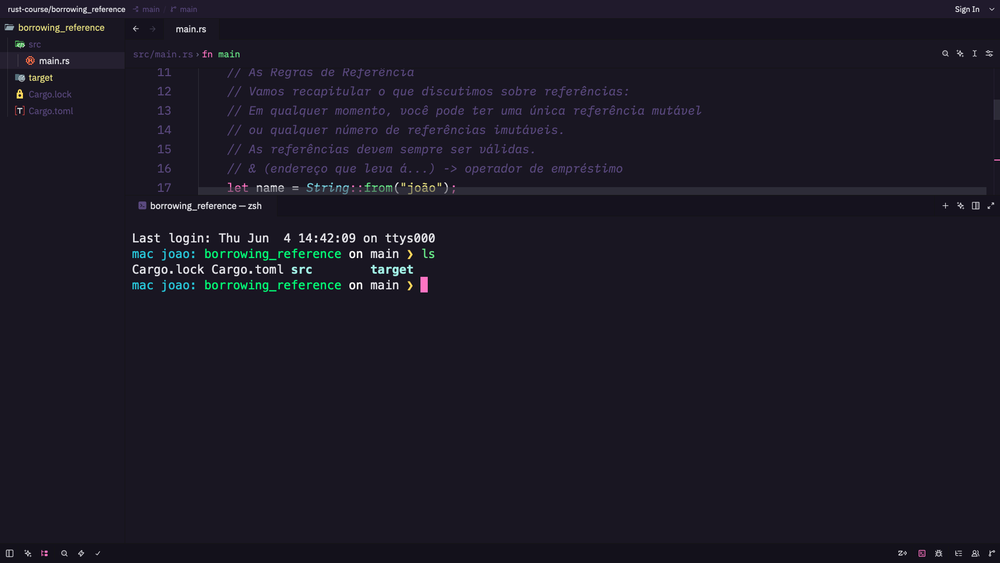

# Omni Theme for Zed Editor

A dark, modern, and vibrant theme for [Zed](https://zed.dev/), directly inspired by the official **Omni** theme by [Rocketseat](https://rocketseat.com.br/).

## Preview

*(Showcasing Rust syntax highlighting, smooth UI elements, and custom status colors)*

## ✨ Features

*   **Vibrant Syntax Highlighting:** Carefully mapped colors (`#FF79C6`, `#67e480`, `#78D1E1`, etc.) for excellent readability, providing a beautiful coding experience in languages like Rust, TypeScript, Python, and more.
*   **Custom UI Diagnostics:**
    *   **Errors:** Highlighted in bold Pink (`#FF79C6`) to keep the interface vibrant while still grabbing your attention.
    *   **Git Status:** Modified and Deleted files are marked in Yellow (`#e7de79`) for a unified source-control visibility.
*   **Deep Contrast:** Immersive background colors (`#191622`) that reduce eye strain during long coding sessions, keeping focus exactly where it matters: the code.

## 🚀 Installation

1. Open **Zed**.
2. Open the Command Palette (`Cmd + Shift + P` on macOS or `Ctrl + Shift + P` on Windows/Linux).
3. Type `zed: extensions` and press `Enter`.
4. Search for **Omni** and click **Install**.
5. Open the Command Palette again, type `theme: select`, search for **Omni**, and hit `Enter`.

## 🤝 Contributing

Found a specific token that could look better? Have a suggestion for the UI? Feel free to open an issue or pull request in the repository!

1. Fork the project
2. Create your Feature Branch (`git checkout -b feature/AmazingFeature`)
3. Commit your Changes (`git commit -m 'Add some AmazingFeature'`)
4. Push to the Branch (`git push origin feature/AmazingFeature`)
5. Open a Pull Request

## 👤 Credits

*   Ported to Zed by [João Gabriel Valentim Theodoro](https://github.com/JoaoGaValentim).
*   Original Omni color palette and design by [Rocketseat](https://github.com/Rocketseat/omni-theme).